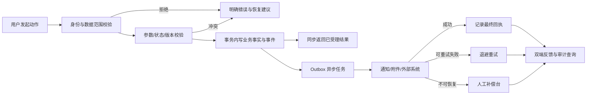
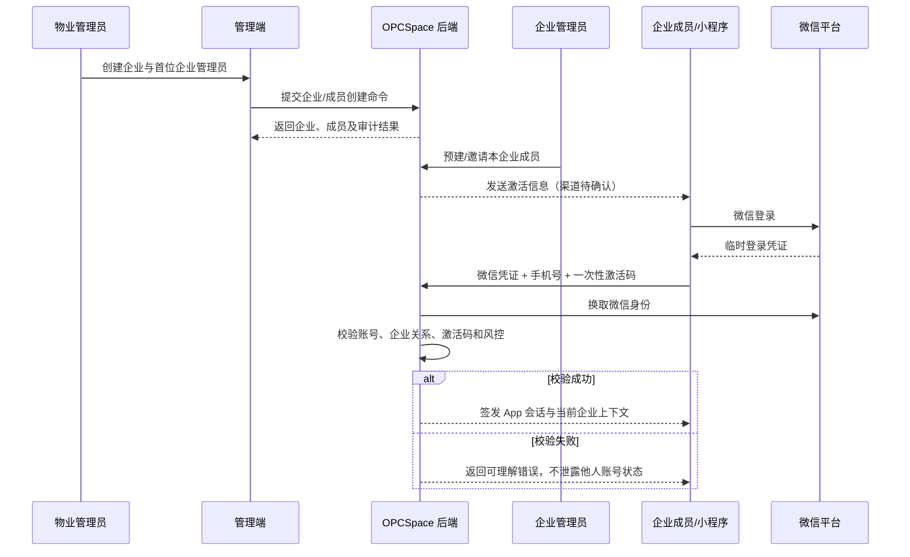
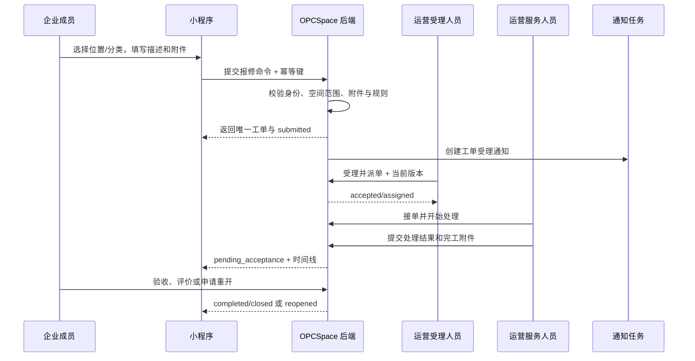
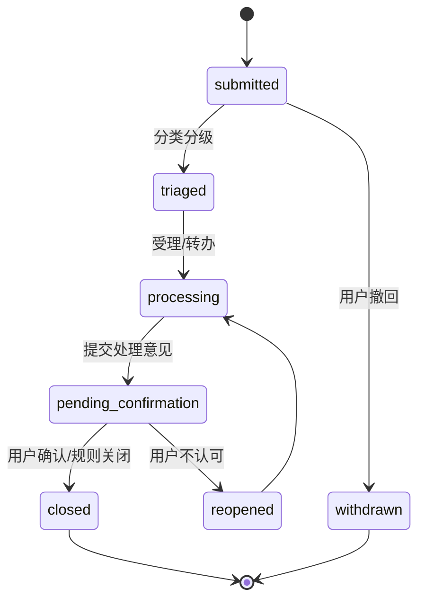
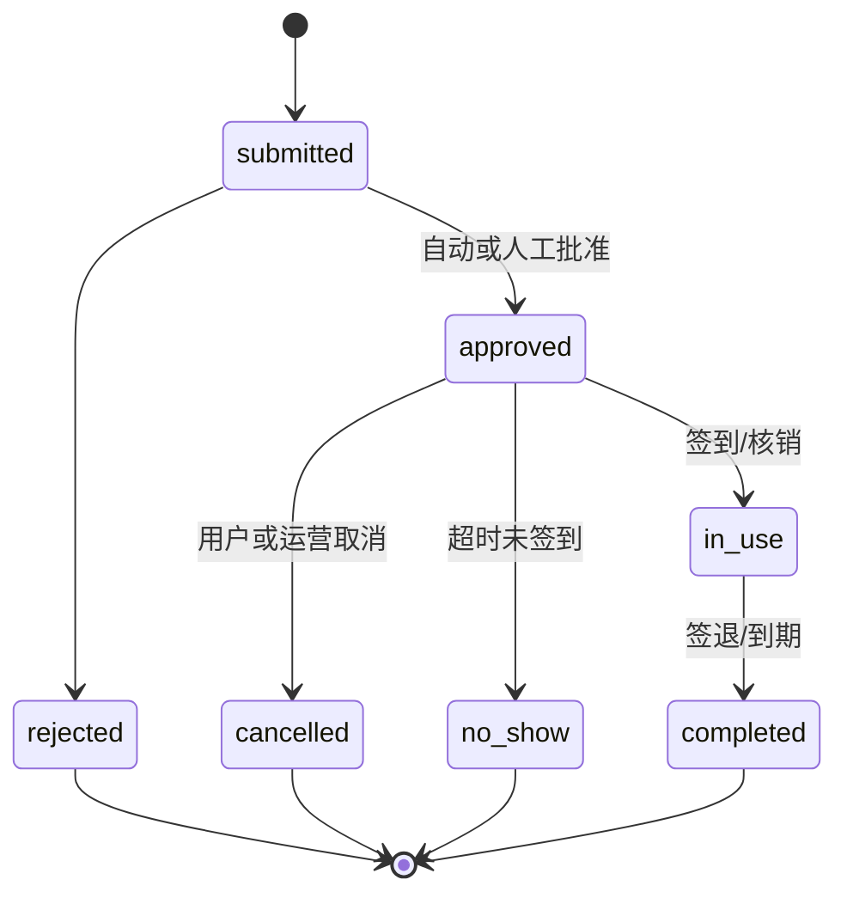
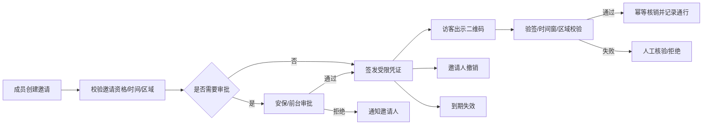
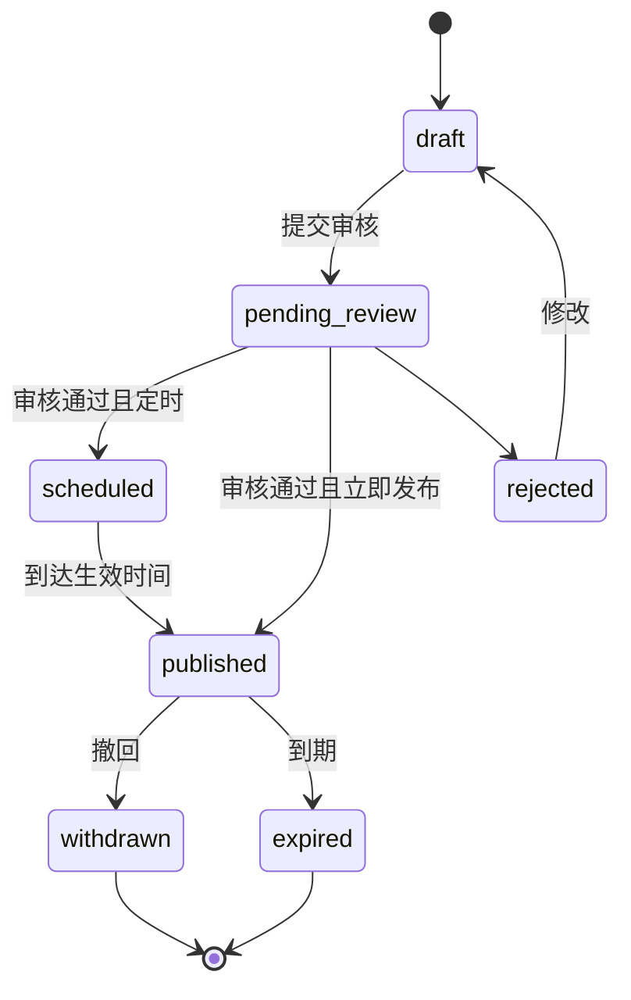
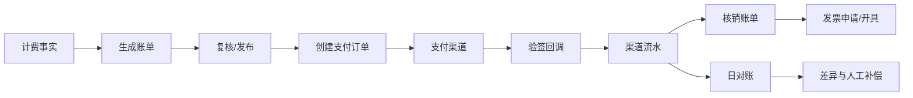

# OPCSpace 候选业务流程与动作契约 v0.1

> 文档状态：历史候选流程，供下一阶段逐 `FC-*` 闭环评审使用，不是当前已确认需求。
> 当前范围以 [OPCSpace PRD v0.3](./OPCSpace-PRD-v0.3.md) 为准，功能事实以[功能联动集合 v0.3](./OPCSpace-MINI-ADMIN-FUNCTION-LINKAGE-COLLECTION-v0.3.md)为准。
>
> 所有动作均为“人发起、系统校验并执行”的业务命令；本文不授权 AI 自主操作。
>
> 标记为“后续”的流程用于形成可实现边界，不代表当前代码已经实现。
>
> 范围约束：不包含设备台账、物业巡检、维保和设备告警；普通报修由运营服务人员处理；访客门禁、闸机和核销硬件保留。

## 1. 统一动作闭环

每个动作必须回答：谁能做、针对什么对象、需要什么输入、前置状态是什么、成功后改变什么、重复/并发如何处理、失败如何恢复、谁收到什么反馈、留下哪些审计与测试证据。

## 2. 流程一：企业成员预建与激活（候选）

### 2.1 业务流程

### 2.2 动作 AC-IDENTITY-01：预建企业成员

| 要素 | 契约 |
|---|---|
| 发起者 | 物业授权人员，或已激活的企业管理员 |
| 目标 | 指定 `company` 下的新 `company_member` |
| 输入 | 姓名、已验证手机号、企业角色、有效期；物业发起时可指定首位企业管理员 |
| 前置 | 企业有效；发起者具有本企业/项目数据范围；手机号冲突规则已通过 |
| 成功效果 | 创建或邀请成员关系；生成哈希激活凭据及过期时间；写审计与通知任务 |
| 幂等 | 客户端幂等键 + 企业/手机号/有效成员唯一性约束 |
| 失败与恢复 | 重复成员返回现有状态；消息失败不删除成员，允许重发新凭据并使旧凭据失效 |
| 人工接管 | 物业可在审计授权下强制停用、重发或修正企业关系 |
| 反馈 | 管理端显示成员状态、激活过期时间和通知送达状态，不展示明文激活码 |
| 审计 | 发起者、来源端、企业、字段差异、凭据批次、原因、请求 ID |

### 2.3 动作 AC-IDENTITY-02：首次激活

| 要素 | 契约 |
|---|---|
| 发起者 | 小程序当前微信用户 |
| 输入 | 微信临时凭证、已验证手机号证明、一次性激活码 |
| 前置 | 成员预建且有效；企业有效；激活码未使用且未过期；尝试次数未超限 |
| 成功效果 | 绑定 `wechat_identity` 与 `app_user`；激活码一次性失效；签发 App JWT |
| 原子性 | 身份绑定、凭据失效、成员激活必须在同一事务边界，避免一码多绑 |
| 失败与恢复 | 错误响应不暴露手机号是否存在；过期可由管理员重发；风控锁定后人工核验 |
| 补偿 | 若微信换绑/手机号变更，走独立高风险流程，不直接覆盖原绑定 |
| 审计/测试 | 重复使用、并发激活、停用账号、跨企业、过期、错误次数、token 受众均有负向测试 |

## 3. 流程二：报修工单候选流程

### 3.1 端到端流程

### 3.2 动作 AC-WO-01：提交报修

| 要素 | 契约 |
|---|---|
| 发起者 | 已激活、未停用的企业成员 |
| 输入 | 授权空间、问题分类、描述、联系人、期望时段、已完成附件 ID、幂等键 |
| 前置 | 成员—企业—项目关系有效；空间可服务；分类已发布；附件扫描通过 |
| 成功效果 | 创建 `submitted` 工单、首条状态事件、SLA 快照、审计和通知任务 |
| 幂等 | 同一身份 + 同一幂等键返回同一工单；不能以相同文本自动合并不同意图 |
| 同步反馈 | 工单号、当前状态、提交时间、预计首次响应说明 |
| 失败 | 表单错误指出字段；空间失效要求重选；附件未完成允许续传；服务异常可安全重试 |
| 人工接管 | 客服可在用户授权/电话记录下代建，必须标注来源和原始请求人 |
| 测试 | 重复点击、超时重试、跨空间、附件失败、停用瞬间、超长文本、恶意文件 |

### 3.3 动作 AC-WO-02：受理与派单

| 要素 | 契约 |
|---|---|
| 发起者 | 运营受理/调度人员 |
| 输入 | 工单 ID、当前版本、优先级、班组/责任人、计划到场、受理说明 |
| 前置 | 工单为 `submitted/accepted/reopened` 的允许状态；人员在项目范围且可接单 |
| 成功效果 | 写受理/派单记录与状态事件，计算或更新 SLA，通知责任人与请求人 |
| 并发控制 | 乐观锁；并发派单只有一个成功，失败方刷新后再处理 |
| 失败与恢复 | 无可用人员可保留待调度并升级；通知失败进入重试，不回滚派单 |
| 转派 | 必须输入原因并保留前后责任人；是否需要主管批准按优先级配置 |
| 审计/测试 | 数据范围、职责分离、并发、离岗人员、重复命令、跨项目派单 |

### 3.4 动作 AC-WO-03：开始处理、挂起与恢复

| 要素 | 契约 |
|---|---|
| 发起者 | 当前责任人、授权班组负责人 |
| 开始处理 | `assigned -> processing`，记录到场/开始时间，可补充现场诊断 |
| 挂起 | `processing -> suspended`，必须选择原因、预计恢复时间与责任方 |
| 恢复 | `suspended -> processing`，记录恢复依据；SLA 是否停表由挂起原因规则决定 |
| 失败与补偿 | 非当前责任人、无效状态或版本冲突被拒绝；离岗由调度转派，不篡改历史 |
| 反馈 | 请求人看到“处理中/等待条件”等用户可理解文案，不暴露内部敏感备注 |
| 审计/测试 | SLA 计时、跨班组、重复开始、挂起超时、权限变化和时区边界 |

### 3.5 动作 AC-WO-04：提交完工

| 要素 | 契约 |
|---|---|
| 发起者 | 当前责任人或授权班组负责人 |
| 输入 | 处理结果、原因分类、耗材/工时（可选）、完工附件、是否需回访 |
| 前置 | 工单在 `processing`；必填结果完整；附件已完成且有访问授权 |
| 成功效果 | `processing -> pending_acceptance`；记录结果、SLA、事件；通知请求人验收 |
| 失败与恢复 | 附件失败时保持处理中并保存可恢复草稿；通知失败不回滚完工 |
| 禁止 | 运营服务人员直接代表用户验收；修改历史处理记录而不留版本 |
| 审计/测试 | 缺失材料、并发转派、账号停用、重复完工、通知失败 |

### 3.6 动作 AC-WO-05：验收、评价与重开

| 要素 | 契约 |
|---|---|
| 发起者 | 原请求人；企业管理员代验收规则待确认 |
| 验收输入 | 是否解决、满意度、评价文字、可选图片 |
| 成功效果 | `pending_acceptance -> completed -> closed`，写评价与关闭事件 |
| 重开 | 在规定窗口内选择未解决原因，`pending_acceptance/completed -> reopened`，重新进入调度 |
| 超时 | 定时提醒；到期按规则自动关闭并记录规则版本，用户仍可走投诉/申诉 |
| 风险控制 | 责任人不得代替请求人评价；同一工单只能有一份有效评价，修改保留版本 |
| 测试 | 重复评价、超期、自动关闭并发、低分回访、请求人离职、权限变化 |

## 4. 流程三：投诉建议候选流程

### 动作 AC-COMPLAINT-01：提交与处置

- 身份与输入：实名成员提交分类、描述、诉求、附件；是否允许匿名、匿名对谁可见为 P0 待确认。
- 前置：成员有效，分类可用；涉及安全/消防/人身风险时自动提升优先级但必须人工确认。
- 成功：创建投诉与受理 SLA，不直接等同于报修；需要现场作业时由客服显式转为关联工单。
- 反馈：用户看到受理人角色、节点和可公开处理意见；内部调查记录不可直接下发。
- 失败/补偿：转办失败保留原责任部门并升级；匿名解密、撤回、删除均是审计动作。
- 验收：重复提交、敏感信息、跨企业可见性、超时升级、重开、关联工单关闭不同步等场景通过测试。

## 5. 流程四：空间预约候选流程

### 动作 AC-BOOKING-01：创建预约

| 要素 | 契约 |
|---|---|
| 发起者 | 有预约资格的企业成员 |
| 输入 | 资源、开始/结束时间、人数、用途、增值设施需求、联系人、幂等键 |
| 前置 | 资源已发布；容量和开放规则满足；企业无禁用限制；时段未冲突 |
| 成功效果 | 事务内完成冲突检查并创建预约；按规则自动批准或进入审批 |
| 并发 | 数据库唯一区间策略/锁定方案在技术设计确定；仅前端禁选不足以防冲突 |
| 取消/补偿 | 按取消窗口释放资源；物业取消必须给出原因并通知；收费退款后续独立处理 |
| 反馈 | 明确“已提交/待审批/已批准”，不得在待审批时展示可用凭证 |
| 测试 | 同时抢订、跨午夜、时区、容量、重复提交、取消与审批并发、爽约 |

### 动作 AC-BOOKING-02：审批与履约

- 审批者由资源规则决定，不能由客户端指定；提交人与审批人是否必须分离按资源级别配置。
- 批准后生成受限凭证，凭证含预约、时间窗、区域和签名，不含不必要个人信息。
- 签到记录幂等；现场登记服务不可用时由运营人员人工登记，恢复后对账而非重复登记。
- 资源临时不可用时由运营发起取消/改期建议，用户确认结果有独立记录。

## 6. 流程五：访客邀请与核销候选流程

### 动作 AC-VISITOR-01：邀请并签发凭证

- 输入：访客最小必要信息、到访时间窗、被访企业/成员、访问区域和事由；身份证件是否收集待合规确认。
- 前置：邀请人有效且有资格；访问区域开放；黑名单/频次规则命中只进入人工复核，禁止无解释自动拒绝。
- 成功：创建邀请；审批通过后用服务端密钥签发可撤销、可过期凭证。
- 重试/防重放：邀请命令幂等；二维码应短时动态或使用服务器核验，核销动作幂等并防截屏复用。
- 外部失败：门禁下发失败不将邀请标为“已可通行”，显示“凭证已生成/设备授权处理中/人工核验可用”等真实状态。
- 审计：审批、签发、查看敏感信息、撤销、核销、人工放行与设备回执全部留痕。

## 7. 流程六：内容发布与活动报名候选流程

### 动作 AC-CONTENT-01：审核与发布

| 要素 | 契约 |
|---|---|
| 发起者 | 内容编辑提交；授权复核人审核/发布 |
| 输入 | 类型、标题、正文、封面、受众、发布时间、到期时间、版本 |
| 前置 | 富文本清洗和链接白名单通过；附件有效；受众范围合法；提交/复核职责满足 |
| 成功效果 | 形成不可变发布版本；到点发布；向目标用户建立可查询内容与可选通知任务 |
| 撤回 | 需原因；内容不可见但发布与撤回记录保留；紧急撤回权限单独控制 |
| 失败 | 定时任务失败进入补偿；通知失败不改变已发布事实；受众计算失败不得默认全量发送 |
| 测试 | XSS、错受众、时区、重复发布、提交人复核、撤回缓存、通知风暴 |

### 动作 AC-ACTIVITY-01：报名与容量

- 报名资格、人数和重复报名在服务端校验；容量扣减与报名创建必须一致。
- 满额后可进入候补；取消释放名额时按规则递补并通知，通知失败不丢失递补资格。
- 报名凭证只在成功状态生成；签到幂等，人工签到注明操作者和原因。

## 8. 流程七：账单、支付与发票候选边界

### 动作 AC-FINANCE-01：支付结果入账

- 支付订单、渠道流水、账单核销和发票是不同对象，不能用一个 `paid` 字段覆盖全部事实。
- 回调必须验签、防重放、容忍重复和乱序；以渠道交易号和商户订单号建立唯一映射。
- “收到 HTTP 200”只表示回调被接收，不代表对账结束；金额、币种和订单必须匹配后才核销。
- 退款与红冲走独立审批和渠道回执；失败进入人工补偿，任何金额调整保留来源和会计日期。
- 在渠道、财务权威系统、税务接口和责任人未确认前，本流程不进入开发排期。

## 9. 流程八：AI 问答与动作草稿（V2）

未来 AI 只分两层：

1. 知识问答：基于已授权、可引用版本的知识源回答，展示引用与更新时间；不把答案写成业务事实。
2. 动作草稿：AI 只能生成结构化草稿，由确定的真实用户查看、修改和确认，再调用与普通页面相同的业务 API。

高风险动作（支付、退款、开门、发票、导出、权限、配置发布）强制人工审批或二次确认。模型输出、提示版本、权限快照、引用、确认人和最终执行结果纳入审计；模型不可直接访问数据库写接口。

## 10. 通用反馈与人工补偿台

管理端治理中心需要统一展示：

| 维度 | 内容 |
|---|---|
| 业务对象 | 对象类型、编号、当前权威状态 |
| 执行任务 | 通知、上传处理、外部下发、回调、导出等任务状态 |
| 失败分类 | 参数/权限/业务冲突/网络/供应商/数据不一致/未知 |
| 恢复动作 | 自动重试、重新发起、撤销、对账、人工确认、标记无需处理 |
| 风险控制 | 操作权限、二次确认、原因、附件证据、职责分离 |
| 审计 | 原请求、响应摘要、重试历史、操作者、处理结论和时间 |

补偿动作必须可重复评估、默认幂等，不能通过直接改数据库“修好状态”。无法自动恢复时，系统提供明确责任人、截止时间和升级路径。

## 11. 可实现功能的交付切片

| 切片 | 后端 | 管理端 | 小程序 | 验收重点 |
|---|---|---|---|---|
| S0 基座 | 登录、权限、OpenAPI、迁移、审计框架 | 若依登录/菜单/字典 | Vue3/uni-app CLI 基座 | 三端独立构建与环境隔离 |
| S1 主数据 | 项目/空间/企业/成员 | 台账与数据范围 | 当前企业/身份 | 越权与状态有效性 |
| S2 激活 | 微信身份、激活码、App JWT | 成员预建/停用 | 登录/激活/错误恢复 | 并发激活与 token 隔离 |
| S3 报修创建 | 工单、附件、幂等、SLA | 待受理列表 | 提交/详情/时间线 | 重试不重复、跨端一致 |
| S4 工单执行 | 派单、处理、状态事件 | 工单详情/派单/处理 | 进度与通知 | 并发、转派、挂起、通知失败 |
| S5 验收闭环 | 评价、重开、自动关闭 | 回访/SLA/审计 | 验收/评价 | 规则版本和完整追责 |
| S6 园区服务 | 投诉/预约/访客/内容 | 对应运营页面 | 对应服务入口 | 冲突、凭证、受众与补偿 |

每个切片都必须同时完成正常路径、异常路径、权限负向、审计和 E2E，不允许只交付页面或只交付 CRUD。
