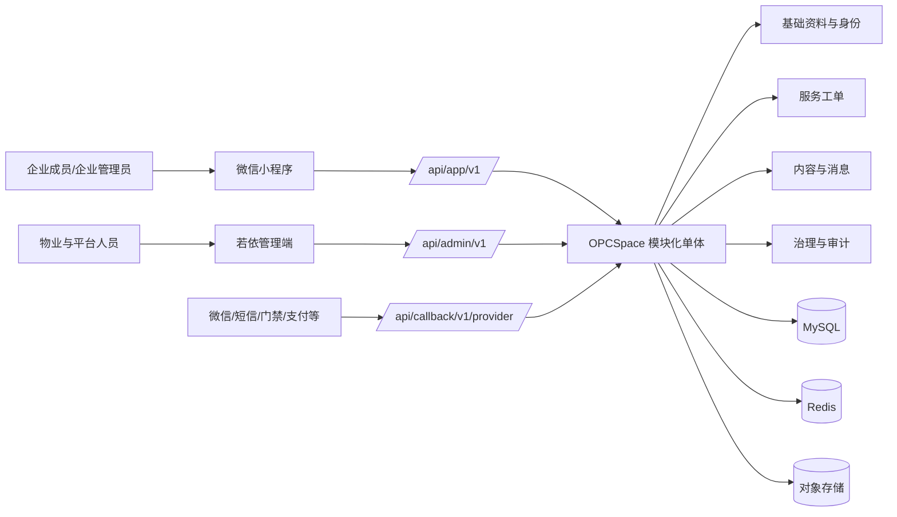
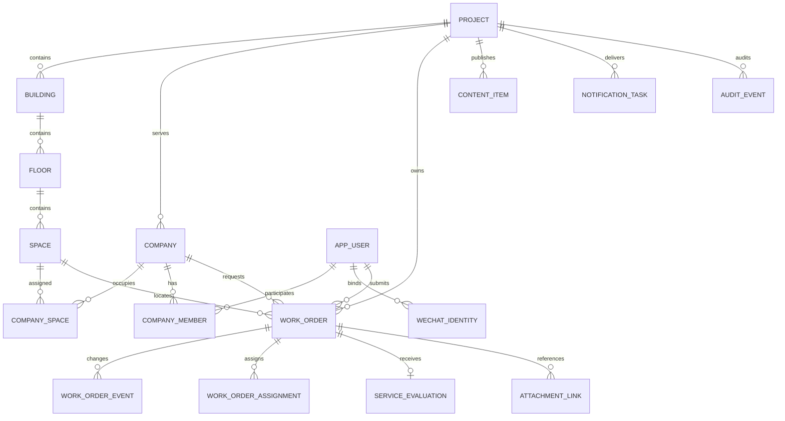
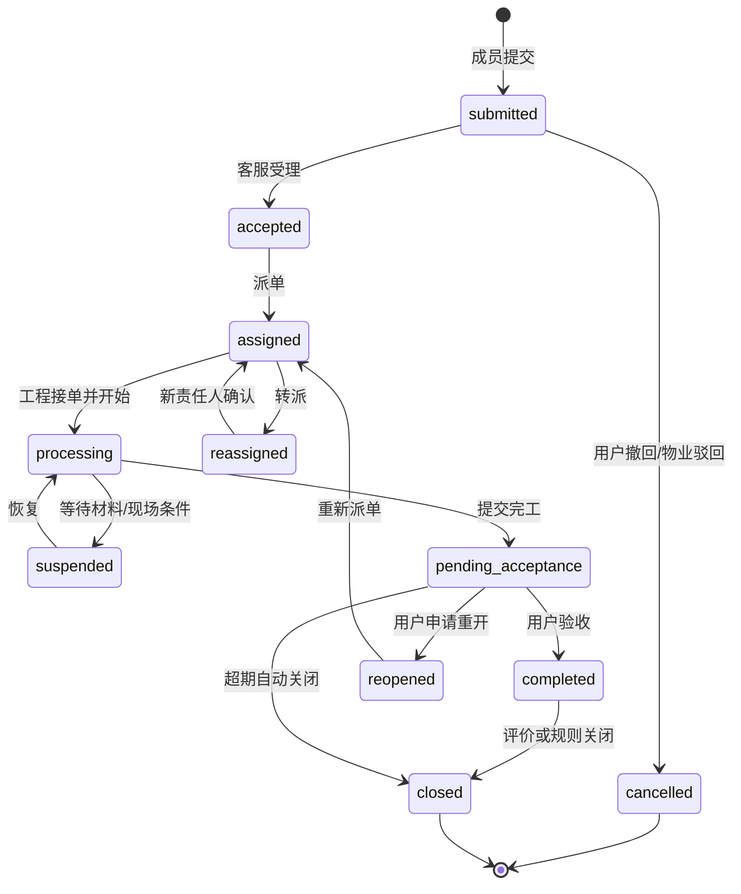

# OPCSpace 园区服务一体化平台 PRD

> 文档版本：v0.1（需求讨论稿）
>
> 编制日期：2026-08-28
>
> 首发场景：和盛大厦单项目试点
>
> 产品形态：物业管理端 + 微信小程序 + 统一业务后端
>
> 公开仓库：<https://github.com/justaboyhai-wq/opcspace>
>
> 配套文档：[业务流程与动作契约](./OPCSpace-BUSINESS-FLOWS-v0.1.md) · [待确认事项](./OPCSpace-PENDING-TOPICS.md)

## 文档说明

本 PRD 依据仓库内冻结的管理端、小程序端原型、已批准的一体化工程设计和当前若依基座编制。它描述的是目标产品，不代表这些业务能力已经完成。

证据状态统一使用以下标记：

| 标记 | 含义 |
|---|---|
| `原型证据` | 冻结原型中有页面、字段或交互，可作为需求输入，不等于真实业务已实现 |
| `已确认` | 已在前序产品讨论中明确的范围、架构或组织决策 |
| `规划` | 本 PRD 给出的产品方案，需进入评审、设计和研发 |
| `待确认` | 缺少业务制度、供应商协议或量化基线，不在文档中虚构答案 |

当前工程事实：`prd-demo/` 是本地演示证据；`services/backend/` 与 `apps/mini-app/` 已导入若依源码快照，但仍需切换正式候选基线；`apps/admin-web/` 目前只是边界占位。首期业务模块、真实 API、数据库和双端业务闭环尚未实现。

---

# 第一章 产品背景与目标

## 1.1 背景

现有原型已经覆盖物业服务、工程设施、财务、租赁、运营、内容、用户和治理等丰富场景，但管理端与小程序是两套独立的浏览器内存演示：没有可信登录、服务端权限、数据库、接口、跨端状态同步、外部系统回执和持久审计。继续直接堆叠前端页面，会形成“看起来完整、实际无法运营”的产品。

OPCSpace 的目标不是简单复刻页面，而是把原型中的服务意图收敛为可运营、可追责、可迭代的一体化园区产品：企业成员在小程序发起服务，物业人员在管理端受理和执行，统一后端维护权威身份、业务状态、通知和审计。

## 1.2 产品愿景

为园区内的物业团队、入驻企业与个人成员提供一个统一服务入口和运营工作台，使一次服务从“发起—受理—执行—反馈—评价—复盘”全程可见、可控、可追溯。

## 1.3 首期业务目标

1. 建立和盛大厦的项目、楼宇、空间、企业、成员和物业组织主数据。
2. 打通管理端与微信小程序的两套受控身份域，禁止未预建或已停用账号进入园区业务。
3. 以报修工单为第一条黄金纵切，完成小程序提交、后台派单、工程处理、用户验收评价的真实闭环。
4. 复用若依的用户、部门、角色、菜单、字典、日志和代码生成能力，形成可持续开发规范。
5. 建立 OpenAPI、权限码、状态词汇、数据库迁移和发布清单，避免两端各自定义业务事实。

## 1.4 成功指标

首轮试点前先采集 2 周人工业务基线。下列目标为建议值，业务评审后冻结：

| 指标 | 定义 | Alpha 建议目标 |
|---|---|---:|
| 受控激活成功率 | 有效预建成员中成功绑定微信身份的人数占比 | ≥ 95% |
| 报修创建成功率 | 合法提交最终形成唯一工单的请求占比 | ≥ 99% |
| 首次响应达标率 | 在服务类型 SLA 内完成受理的工单占比 | ≥ 90%，待确认 |
| 按时完工率 | 在承诺时间内进入待验收状态的工单占比 | ≥ 85%，待确认 |
| 跨端状态一致率 | 抽检时管理端与小程序状态、时间线一致的记录占比 | 100% |
| 审计完整率 | 关键状态变更具备操作者、时间、前后状态和原因的占比 | 100% |
| 越权阻断率 | 权限与数据范围负向用例被正确拒绝的占比 | 100% |

## 1.5 非目标

首个 Alpha 不建设多物业 SaaS 平台，不上线真实支付/退款/电子发票，不接门禁、停车、BA、电表，不实现完整资产、租赁和财务系统，不让 AI 自动执行业务动作，也不部署静态 PRD 演示网站。原型中的这些页面保留为产品蓝图，不进入首期承诺。

# 第二章 用户与场景

## 2.1 用户体系

| 用户 | 主要目标 | 使用端 | 数据边界 |
|---|---|---|---|
| 平台管理员 | 系统配置、角色、权限、审计和跨项目治理 | 管理端 | 授权项目范围 |
| 物业客服/前台 | 受理报修投诉、访客与服务咨询 | 管理端 | 本项目及职责范围 |
| 工程人员/值班人员 | 接单、处理、巡检、填写结果 | 管理端，后续可扩展移动工作台 | 本人、本班组或分配任务 |
| 财务人员 | 账单、对账、发票和退款复核 | 管理端 | 本项目财务范围，职责分离 |
| 招商/租赁人员 | 企业、合同、续租、装修和承包商管理 | 管理端 | 本项目租赁范围 |
| 内容运营 | 公告、活动、Banner 和企业服务发布 | 管理端 | 本项目内容范围 |
| 安保人员 | 访客、通行、停车异常处置 | 管理端 | 本项目安保范围 |
| 企业管理员 | 管理本企业成员、查看企业服务和聚合记录 | 小程序；后续可有企业工作台 | 本企业 |
| 企业成员 | 报修、投诉、预约、访客、查询个人服务 | 小程序 | 本人及授权企业范围 |
| 服务商/承包商 | 处理分配任务、提交进场或完工材料 | 后续受限工作台 | 本组织被分配对象 |
| 访客 | 使用临时凭证进入指定区域 | H5/小程序受限页，待确认 | 单次邀请范围 |
| 审计/管理人员 | 查询操作记录、抽检服务质量 | 管理端 | 授权审计范围 |

## 2.2 核心场景

### 场景 A：企业成员首次激活

物业先创建企业与首位企业管理员，企业管理员再预建或邀请成员。成员微信登录后使用已验证手机号和一次性激活码绑定，后端校验企业关系和账号状态后签发 App 身份。未预建、停用或关系失效的成员不可绕过激活进入业务。

### 场景 B：成员报修与物业处置

成员选择授权位置、问题类型、描述和图片提交报修；客服受理并派给工程人员；工程人员接单、处理和完工；成员查看统一时间线并验收评价。通知失败不能改变业务事实，超时、转派、挂起和重开都有原因与审计。

### 场景 C：园区公共服务

成员预约会议室/活动空间、邀请访客、报名活动或申请企业服务；物业在后台审核、配置资源、生成凭证并跟踪履约。此类能力进入后续 MVP，复用同一身份、审批、通知、附件和审计底座。

### 场景 D：运营与治理

管理人员通过工作台查看待办、SLA、告警和服务趋势；平台管理员配置角色、菜单、业务字典和数据范围，并对高风险操作进行复核、留痕和追责。

## 2.3 关键使用约束

- 首发只有和盛大厦，但所有核心业务显式保存 `project_id`。
- 物业部门树与入驻企业组织分离：`sys_dept` 不代替 `company`。
- 管理端身份与小程序身份不复用 token，服务端从可信身份计算项目/企业范围。
- 企业管理员只能管理本企业成员；物业可跨企业查询，但必须受项目与岗位授权限制。
- 访客不创建完整园区账号，只持有可过期、可撤销、可核销的有限凭证。

# 第三章 痛点与产品价值

| 当前痛点 | 造成的问题 | 产品设计回应 |
|---|---|---|
| 两端原型互不连通 | 用户提交与后台处置无法形成同一记录 | 统一后端、统一实体 ID、统一状态事件和 OpenAPI |
| 状态和权限只在前端模拟 | 刷新丢失、可越权、无法审计 | 后端状态机、四层权限、数据范围和不可缺失的审计上下文 |
| 大量按钮只有成功提示 | 外部失败、重试、部分成功不可见 | 所有写操作区分受理、处理、成功、失败和人工补偿 |
| 企业、空间、账号多处重复表达 | 跨模块引用不一致 | `opc-foundation` 建立唯一主档与版本化变更 |
| 直接按页面生成 CRUD | 领域耦合、状态规则散落 | 标准台账生成、领域对象增强、复杂编排定制的三级模式 |
| 用户不知道进度，物业缺少责任视图 | 催问多、超时难发现 | 统一时间线、SLA、待办、通知与升级规则 |
| 缺少交付追踪 | 原型、PRD、API、权限、表和测试脱节 | 建立需求追踪矩阵与根仓发布清单 |

OPCSpace 的直接价值是提高服务流转效率和用户透明度；长期价值是把园区服务形成可量化的运营数据，在稳定业务闭环之上逐步扩展设施、租赁、财务与智能助手，而不是一次性建造无法验证的“大而全”平台。

# 第四章 产品范围与功能结构

## 4.1 管理端功能地图

| 一级域 | 原型证据与目标能力 | 首期级别 |
|---|---|---|
| 工作台 | 总览、我的待办、运营分析、告警、值班；展示各业务域真实聚合，不自建事实 | Alpha：报修待办/SLA；其余后续 |
| 基础资料 | 项目、楼宇、楼层、空间、企业、成员、服务商、服务类型 | Alpha |
| 物业服务 | 报修工单、工单详情、投诉建议、保洁绿化、客服会话转工单 | Alpha：报修；MVP：投诉/保洁/客服 |
| 工程设施 | 资产台账、资产详情、巡检、告警转工单、维保计划 | V1 |
| 财务 | 账单、对账、发票、电费、空调加时、押金、报表 | V1.5；真实支付另行准入 |
| 租赁 | 企业租户、合同、续租、装修、承包商 | V1 |
| 运营 | 空间资源、预约日历、停车、访客 | MVP：预约/访客；停车 V1.5 |
| 内容 | 公告、活动、企业服务、订阅、反馈、Banner | MVP；Alpha 仅基础公告/消息 |
| 用户与隐私 | 小程序账号、企业关系、激活/停用、隐私请求与授权记录 | Alpha：账号；隐私全生命周期 MVP |
| 治理 | 审批、服务台、AI 运营、自动化执行、补偿任务 | Alpha：基础审计/通知；其余 V1+ |
| 系统 | 账号、部门、角色、菜单、消息、审计、数据质量、配置发布、字典、代码生成 | 复用若依并按风险增强 |

管理端复杂度按三级实施：基础字典和标准台账用代码生成；企业、空间、工单等领域对象在生成骨架上增加数据范围、状态机和领域服务；运营看板、工单详情、预约日历、审批/对账等采用定制页面。

## 4.2 小程序功能地图

| 一级入口 | 功能 | 版本 |
|---|---|---|
| 首页 | 项目信息、公告、快捷服务、待办/进度卡片、活动推荐 | Alpha 基础版，MVP 完整版 |
| 服务 | 报修、投诉、保洁绿化、空间预约、访客邀请、停车、账单发票、电费、企业服务 | Alpha 仅报修；MVP 扩展投诉/预约/访客/内容 |
| 消息 | 工单进度、审批结果、预约提醒、公告订阅、异常提醒 | Alpha 基础站内消息，微信订阅消息待准入 |
| 企业 | 我的企业、成员管理、服务申请、合同/续租、企业转账 | Alpha 成员关系；其他 V1+ |
| 活动与内容 | 公告详情、活动中心、报名凭证、订阅偏好 | MVP |
| AI 管家 | 问答、历史、业务草稿、敏感动作确认 | V2；首期只保留原型证据，不承诺执行 |
| 我的 | 身份与企业切换、服务记录、访客记录、付款/发票记录、客服、反馈、关于和隐私 | 分版本随业务开放 |

## 4.3 Alpha 功能详述

### F-01 管理端登录与权限

- 使用若依账号、部门、角色、菜单和操作权限。
- 登录后只返回当前账号可见菜单与项目数据范围。
- 账号停用、密码策略、会话失效、登录日志和操作日志按若依能力增强。
- 验收：隐藏按钮不能替代后端拒绝；跨项目、跨岗位和无状态权限请求必须失败。

### F-02 项目与空间主数据

- 维护项目、楼宇、楼层、空间的唯一编码、名称、状态、层级和可服务属性。
- 空间停用后不允许新建服务，但历史记录保留原关联快照。
- 首发数据只录入和盛大厦；导入模板与数据责任人 `待确认`。

### F-03 企业与成员

- 物业创建企业、首位企业管理员和企业—空间关系。
- 企业管理员预建/邀请、停用本企业成员；物业拥有审计和强制停用权。
- 成员支持在职、停用、离职等状态；手机号等个人信息按权限脱敏。
- 所有成员变更记录操作者、原因和生效时间。

### F-04 小程序激活与会话

- 微信登录取得平台身份后，使用预建手机号和一次性激活码绑定。
- 激活码哈希保存、24 小时过期、成功使用即失效，连续失败触发限流。
- 微信身份、园区账号、企业成员关系分层保存；解绑/换绑规则列为 P0 待确认。
- App JWT 与 Admin JWT 使用不同受众，不可跨端调用。

### F-05 报修提交

- 成员只能选择其企业授权的项目和空间。
- 必填：位置、问题分类、问题描述、联系人；选填：期望上门时间、图片/视频，具体限制待确认。
- 创建命令携带幂等键；附件必须先完成安全上传，不能引用未完成文件。
- 成功后返回唯一工单号、当前状态和时间线；网络重试不能生成重复单。

### F-06 报修受理、派单与处理

- 客服受理并选择服务班组/工程人员；系统校验岗位、数据范围、在岗状态和工单版本。
- 工程人员接单、开始处理、转派/挂起、填写处理结果与完工附件。
- SLA 按问题类型、优先级和服务时间计算；暂停是否停表及升级对象 `待确认`。
- 并发派单返回版本冲突，不允许最后写入静默覆盖。

### F-07 用户验收与评价

- 完工后进入待验收，成员可确认完成、评价或在规则允许时申请重开。
- 评价至少包含满意度和可选文字；低分触发回访/投诉规则 `待确认`。
- 超期未验收按配置提醒和自动关闭，系统保留规则版本与执行记录。

### F-08 通知与审计

- 工单创建、受理、派单、完工、重开、关闭产生业务事件和站内通知。
- 通知发送失败不回滚工单，进入重试/人工补偿；用户能区分业务状态与消息送达状态。
- 所有关键动作记录身份、角色、项目、企业、对象、前后状态、原因、请求 ID 和时间。

## 4.4 后续可实现的业务能力

### 投诉建议

支持实名/匿名规则、分级分类、受理、转办、处理、用户确认、回访和重开；匿名解密必须是高风险权限。投诉可关联工单，但二者保持独立编号和状态。

### 空间预约

支持资源目录、开放时段、容量/设备、冲突检测、审批、取消、签到、凭证、爽约和统计。创建预约时锁定时段，超时未支付/未审批的释放策略待确认。

### 访客邀请

支持邀请人资格、来访对象、时间窗、区域、审批、二维码签发、核销、撤销和过期。外部门禁只接收最小必要授权，离线与设备失败需有人工放行记录。

### 内容与活动

支持公告/Banner/活动草稿、受众、审核、定时发布、撤回、过期、报名容量、候补和签到。发布使用后端当前身份，提交人与复核人职责分离。

### 工程设施

支持资产唯一主档、点位、巡检计划、任务、问题、告警转工单、维保记录和生命周期。设备告警与工单不合并为一张表，通过来源关系追踪。

### 租赁与企业服务

支持租户档案、合同版本、付款计划、续租/退租提醒、装修申请、承包商与进场检查，以及政策/证照等企业服务申请。合同与财务事实需专门评审后再开发。

### 账单、支付与发票

支持费项、计费周期、账单、调整、支付订单、渠道流水、退款、发票和对账。金额变化必须不可静默覆盖；接入真实渠道前完成协议、回调、幂等、乱序、对账和合规评审。

### AI 管家

首期只允许知识问答构想。未来如生成业务动作，必须先形成可审阅草稿，复用现有 API 权限和状态机，高风险动作二次确认或人工审批；不得让模型直接改表或绕过业务规则。

# 第五章 信息架构与跨端协同

## 5.1 总体信息架构

两端绝不直接互调，也不复制对方内部 DTO。后端是业务事实与状态的唯一权威来源；OpenAPI 是接口权威来源；共享词汇表定义状态、错误码、权限码和事件名称。

## 5.2 核心导航建议

管理端一级导航建议为：工作台、基础资料、物业服务、工程设施、运营服务、租赁管理、财务管理、内容运营、用户与隐私、治理中心、系统管理。未进入当前版本的导航默认不开放，避免“空菜单”。

小程序底部导航建议为：首页、服务、消息、我的。AI 管家在形成可用问答能力前不占用一级入口；企业管理作为“我的企业”进入，只有企业管理员可见成员管理动作。

## 5.3 跨端对象映射

| 小程序视图 | 管理端视图 | 共同业务对象 |
|---|---|---|
| 报修提交/进度/评价 | 工单池/详情/派单/SLA | `work_order`、状态事件、处理记录、评价 |
| 投诉提交/进度 | 投诉池/回访 | `complaint`、转办、反馈 |
| 空间目录/预约凭证 | 资源配置/预约日历 | `space_resource`、`booking`、凭证 |
| 访客邀请/访客码 | 来访审核/核销记录 | `visitor_invitation`、访问凭证 |
| 公告/活动/报名 | 内容编辑/发布/活动运营 | `content_item`、`activity_registration` |
| 账单/支付/发票 | 账单/对账/发票审核 | 独立账单、支付、流水与发票对象 |
| 我的企业/成员 | 企业档案/成员审计 | `company`、`company_member`、`app_user` |

# 第六章 版本规划与取舍

## 6.1 版本路线

| 版本 | 目标 | 核心范围 | 退出门槛 |
|---|---|---|---|
| v0.1 PRD | 需求可评审 | 原型盘点、流程、状态、权限、待确认项 | 业务方确认 P0 决策 |
| v0.2 原型评审版 | 需求可验证 | 关键路径页面和异常态映射 | 原型动作与 PRD 用例一一对应 |
| v0.3 需求冻结版 | 可进入迭代 | 字段、状态、权限、SLA、验收冻结 | 无影响 Alpha 的未决 P0 |
| v0.1.0-alpha | 建立真实纵切 | 基座、双身份域、主数据、报修、基础消息/审计 | 真机完成报修闭环，负向权限通过 |
| v0.2.0-mvp | 园区服务试运行 | 投诉、预约、访客、公告、活动、客服 | 单项目可试运营，关键写操作可追溯 |
| v1.0 | 核心运营平台 | 设施、租赁、企业服务、治理完善 | 业务负责人签字，运行与恢复演练通过 |
| v1.5 | 财务与外部集成 | 账单、支付、发票、停车/门禁等 | 对账、补偿、隐私和安全专项验收 |
| v2.0 | 智能化 | 有证据的问答、可控动作草稿、自动化运营 | 不绕过权限/状态机，全链路可解释审计 |

## 6.2 首期取舍原则

1. 先做闭环，后扩菜单：一个真实报修闭环优先于几十个静态页面。
2. 先做主数据，后做领域交易：企业、成员、空间不重复建档。
3. 先做人工协同，后做自动化：所有关键动作先有人可接管、可补偿。
4. 先做模块化单体，不上微服务：降低部署、事务和排障成本，模块边界为未来拆分保留条件。
5. 先用若依规范形成一致工程，再定制复杂页面：不让代码生成覆盖人工增强。
6. 所有外部集成都以协议和沙箱为准，不以原型成功提示作为能力证明。

## 6.3 依赖与风险

- 正式管理端源码、RuoYi-App Vue 3 和 RuoYi-Vue Spring Boot 3 基线需要作为独立变更落地。
- 微信主体、AppID、体验成员、合法域名和隐私合规材料缺失会阻塞真机联调。
- 和盛大厦组织、企业、空间和服务分类的脱敏基准数据缺失会阻塞主数据验收。
- SLA、投诉匿名、预约取消、访客区域、数据留存等制度未确认会导致流程返工。
- 真实支付、发票、门禁、停车等供应商未确定前，只定义适配边界，不承诺完成日期。

---

# 附录 A：完整业务与数据定义

## A.1 领域边界

| 领域 | 核心对象 | 权威责任 |
|---|---|---|
| 身份与组织 | 管理员、部门、角色、App 用户、微信身份、企业成员 | 认证、授权、关系有效性 |
| 基础资料 | 项目、楼宇、楼层、空间、企业、服务商 | 唯一主档、编码、状态和归属 |
| 物业服务 | 报修、投诉、客服会话、服务记录、评价 | 服务受理、执行、SLA 和用户反馈 |
| 工程设施 | 资产、点位、巡检、告警、维保 | 设施生命周期与问题发现 |
| 运营服务 | 资源、预约、访客、停车、活动 | 园区公共资源与通行服务 |
| 租赁 | 租户、合同版本、付款计划、装修、承包商 | 租赁关系及履约过程 |
| 财务 | 费项、账单、支付订单、渠道流水、退款、发票 | 金额事实、对账和不可变凭据 |
| 内容 | 公告、Banner、活动、企业服务产品 | 受众、审核、发布和下架 |
| 治理 | 审批、通知任务、审计、配置、数据质量、补偿任务 | 跨域控制与运营保障 |

## A.2 核心实体关系

## A.3 通用数据规则

- 主键由服务端生成，不使用前端时间戳或最大编号加一。
- 业务编号与数据库主键分离，编号规则可配置但必须唯一。
- 关键对象含 `project_id`、创建/更新人、创建/更新时间和乐观锁版本。
- 状态变更同时写当前快照与不可缺失的状态事件；普通操作日志不能替代领域事件。
- 删除原则上采用停用/归档；涉及个人信息的删除按保留政策与法定义务执行。
- 金额使用定点数和明确币种；面积、用量、税率、时区、服务日历均需字典化。
- 附件保存元数据、上传状态、扫描状态、授权关系和保留策略，业务记录只引用已完成附件。

# 附录 B：核心机制

## B.1 四层权限

1. 菜单权限：是否进入管理页面。
2. API 权限：是否调用查询或业务命令。
3. 数据范围：可访问的项目、企业、空间、班组、责任人和记录。
4. 状态权限：对象在当前状态下能否被受理、派单、完工、验收、发布、退款等。

高风险动作包括角色授权、数据范围变更、匿名投诉解密、个人数据导出/删除、退款/红冲、配置发布、门禁控制和未来 AI 敏感动作。此类动作要求强化认证、理由、职责分离或双人复核，并写入审计。

## B.2 报修状态机

状态名称将在技术设计阶段统一为稳定英文枚举。`reassigned` 可作为事件而非持久状态，需在 v0.3 前确认。

## B.3 通知与异步反馈

业务事务成功后通过 Outbox 产生通知任务。渠道投递至少包含 `pending/sending/sent/failed/dead/manual_handling`；业务状态不因通知失败回滚。用户端只展示真实业务状态，管理端可查看失败原因、重试次数和人工补偿结果。

## B.4 配置发布

字典、SLA、服务类型、受众规则等配置使用草稿—复核—发布—回滚机制。发布记录绑定版本、差异、提交人、复核人和生效时间；已发生业务保留当时规则快照，不随新配置被追溯改写。

## B.5 数据质量闭环

主数据校验发现重复编码、关系缺失或状态冲突时，生成问题记录；责任人修复或提出裁决；复核后关闭。系统不能自动合并企业、空间、合同等关键主档，除非有明确可撤销规则和审计。

# 附录 C：术语表

| 术语 | 定义 |
|---|---|
| 项目 | 物业服务的独立空间与数据边界，首发为和盛大厦 |
| 企业 | 入驻园区并与物业形成服务关系的组织，不等于若依部门 |
| 企业成员 | App 用户与企业之间具有状态和角色的关系 |
| 工单 | 对一次服务请求的权威执行记录 |
| 状态事件 | 记录对象为何、由谁、何时从何状态变到何状态的不可缺失事实 |
| 业务命令 | 用户表达意图的写请求，例如“提交报修”，而不是直接写最终状态 |
| 幂等键 | 保证同一创建意图因重试只产生一个业务结果的标识 |
| 数据范围 | 当前主体可查询或操作的项目、企业、空间和业务记录集合 |
| SLA | 服务响应、处理和完成的时限规则及其服务日历 |
| 黄金纵切 | 同时贯通前端、后端、数据、权限、通知、审计和测试的首条真实业务链路 |
| 人工补偿 | 外部调用或异步任务失败后，由授权人员核对并完成的可审计处置 |

# 附录 D：非功能与合规要求

- 安全：全链路 HTTPS；服务端鉴权；横向/纵向越权测试；上传类型嗅探、大小限制、病毒扫描；敏感字段脱敏；Secret 不入库。
- 隐私：最小收集、告知同意、用途和留存期限、授权撤回、导出水印、访问审计；微信隐私接口和小程序审核要求需专项确认。
- 可用性：核心查询和写命令的可用目标、P95、并发量在压测基线后冻结；关键写操作不能依赖一次性前端成功提示。
- 弱网：创建命令幂等、上传可重试、状态可恢复；小程序真机验证包体、首屏、弱网和前后台切换。
- 可观测：统一请求 ID、业务编号、指标、结构化日志、链路追踪、告警和值班手册。
- 恢复：版本化迁移、备份与恢复演练、发布回滚；RPO/RTO 在上线评审前确认。
- 可访问：管理端键盘操作、焦点、语义标签和颜色对比不低于原型已体现的可访问性设计。

# 附录 E：验收与追踪

## E.1 Alpha 端到端验收

1. 物业创建企业与企业管理员，企业管理员邀请成员，成员在真机成功激活。
2. 未预建、已停用、跨企业和伪造 `company_id/project_id` 的请求均被后端拒绝。
3. 成员上传附件并连续重试创建请求，只产生一个报修工单。
4. 客服受理派单，两个操作者并发派单时只有一个成功，另一方得到可理解的冲突反馈。
5. 工程人员完成处理，通知失败时工单仍进入待验收，并在补偿台可见失败任务。
6. 成员小程序看到与管理端一致的状态、责任信息和时间线，完成验收评价。
7. 工单关闭后，所有关键动作具备可查询审计证据，且无法由无权限用户篡改。
8. dev/test/staging/prod 配置隔离，仓库与制品不包含真实 Secret 或演示个人数据。

## E.2 需求追踪模板

每个进入开发的功能必须登记：`原型页面/动作 -> PRD 编号 -> 用户故事 -> API -> 权限码 -> 数据表/事件 -> 测试用例 -> 版本 -> 验收证据`。v0.2 建立正式 `docs/traceability/feature-matrix.md` 后，PRD 功能编号保持稳定。

## E.3 PRD 演进规则

- v0.1：当前讨论稿，允许保留明确的待确认项。
- v0.2：完成双端原型动作核对、业务访谈和页面级追踪。
- v0.3：冻结 Alpha 字段、规则、状态、权限、异常和验收，任何范围变化进入变更评审。

# 附录 F：冻结原型覆盖清单

本清单用于证明 PRD 对现有原型进行了覆盖盘点，不表示每个页面都进入同一版本。压缩 bundle 中的页面 ID 只作为追踪锚点，正式路由与模块名在详细设计中确定。

## F.1 管理端原型（10 组、48 个页面定义）

| 分组 | 页面 ID |
|---|---|
| 工作台（5） | `dashboard-overview`、`dashboard-tasks`、`dashboard-analytics`、`dashboard-alerts`、`dashboard-oncall` |
| 物业（4） | `property-work-orders`、`property-work-order-detail`、`property-complaints`、`property-environment` |
| 工程（4） | `engineering-assets`、`engineering-asset-detail`、`engineering-inspections`、`engineering-alerts` |
| 财务（7） | `finance-bills`、`finance-reconciliation`、`finance-invoices`、`finance-electricity`、`finance-hvac-overtime`、`finance-deposits`、`finance-statements` |
| 租赁（5） | `leasing-tenants`、`leasing-contracts`、`leasing-renewals`、`leasing-decoration`、`leasing-contractors` |
| 运营（4） | `operations-spaces`、`operations-bookings`、`operations-parking`、`operations-visitors` |
| 内容（6） | `content-notices`、`content-activities`、`content-enterprise-services`、`content-ai-subscriptions`、`content-feedback`、`content-banners` |
| 用户（2） | `users-accounts`、`users-privacy` |
| 治理（4） | `governance-approvals`、`governance-service-desk`、`governance-ai-ops`、`governance-automation` |
| 系统（7） | `system-accounts`、`system-roles`、`system-messages`、`system-audit`、`system-data-quality`、`system-config-publish`、`system-recharge-visibility` |

## F.2 小程序原型

| 分组 | 原型页面/流程锚点 |
|---|---|
| 一级入口与 AI | 首页、服务、AI、我的；AI 管家、AI 历史、敏感动作草稿确认、产品/订阅页 |
| 通知与客服 | `05-notice-center`、`35-subscriptions`、`36-contact-service`、`37-feedback` |
| 物业服务 | `08-repair-submit`、`09-repair-progress`、`10-repair-evaluation`、`17-cleaning-green-booking`、`18-complaints` |
| 财务服务 | `14-bills-center`、`15-bill-payment-invoice`、`15-invoice-application`、`16-electricity-recharge-analysis`、`31-corporate-transfer`、`33-payment-records`、`34-invoice-records` |
| 空间/访客/停车 | `21-space-catalog`、`22-space-detail-slots`、`23-space-booking-pass`、`12-visitor-invite`、`13-visitor-pass`、`32-visitor-records`、`24-parking-services` |
| 企业与租赁 | `19-lease-contract`、`20-move-flows`、`27-my-company`、`28-company-members`、`29-service-apply`、`30-service-progress`、`11-policy-services` |
| 内容与社区 | `25-activity-center`、`26-activity-registration`、`38-about` |

原型中同义入口可能复用同一页面工厂，例如“账单中心/账单与发票”“空间预订/空间预约”“停车服务/停车缴费”。正式产品应统一业务对象和术语，同时保留符合用户任务的多个入口。
