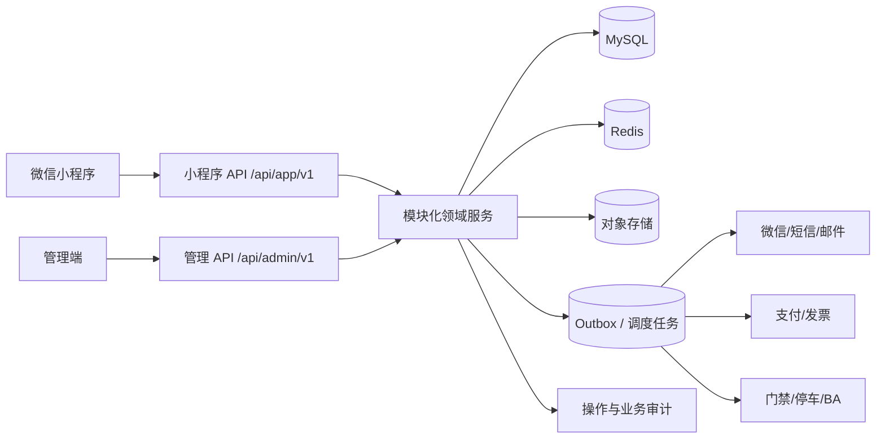

# OPCSpace 园区运营平台实施计划

> **For agentic workers:** REQUIRED SUB-SKILL: Use `subagent-driven-development` (recommended) or `executing-plans` to implement this plan task-by-task. Steps use checkbox (`- [ ]`) syntax for tracking.

**Goal:** 把当前“和盛大厦”双端离线交互原型，建设为具备真实账号、数据、权限、流程、审计和外部集成能力的园区运营平台。

**Architecture:** 以 RuoYi-Vue Spring Boot 3 分支为后端底座，先采用模块化单体而非微服务；管理端使用 Vue 3 + TypeScript 重建，小程序使用 uni-app 重建。两端共享 OpenAPI 契约与领域枚举，但使用独立的管理端 API 和小程序 BFF 视图；身份、数据权限、状态机、幂等和审计全部由服务端负责。

**Tech Stack:** JDK 17、Spring Boot 3、Spring Security、MyBatis、MySQL 8、Redis、Flyway、OpenAPI、Vue 3、TypeScript、Element Plus、uni-app、uni-ui、S3 兼容对象存储、Docker Compose、Playwright。

---

## 1. 当前基线与证据边界

### 1.1 已确认事实

- 当前仓库提交为 `1fd6a9f7c6ba8a68d301c0bad956ad513f4c4061`，只有一个提交。
- `README.txt` 记录小程序冻结点 `0ae90c5`、管理端冻结点 `7e5c3c9`，但这两个 Git 对象不在当前仓库，不能据此证明源码可恢复。
- 当前交付物只有两个静态发布包，没有 `src/`、`package.json`、锁文件、构建配置、测试、CI、API 客户端或 source map。
- `mini-program/` 是 React 19.2.8 浏览器移动端仿真，不是微信原生、uni-app 或 Taro 工程。
- `web-admin/` 是原生 DOM 模板字符串 SPA 的压缩产物，不是可维护的管理端源码工程。
- 两端没有业务网络请求、持久化、真实登录、微信授权、支付、门禁、发票、文件上传或消息投递。
- 原型可用于确认页面、字段、角色、流程意图和视觉基线，不能直接作为数据库设计或生产业务规则。

### 1.2 当前功能体量

- 小程序约 38 个命名界面，覆盖首页、服务、AI、个人中心，以及报修、投诉、账单、充值、发票、访客、空间、停车、活动、企业、合同、代办、客服等功能。
- 管理端有 10 个一级业务组、48 个主页面：工作台、物业、工程、财务、招商、运营、内容、用户、治理、系统。
- 管理端内置 15 个演示角色，但所有权限判断均在浏览器内存中，不能作为安全实现。
- 管理端存在跨集合演示动作，例如告警转工单、客服会话转工单、充值审批回写账户与流水、AI 敏感草稿确认或人工接管。

### 1.3 必须明确的产品标记

PRD 中每个页面和动作都必须标注以下一种实现级别：

1. `展示`：只展示服务说明或静态内容。
2. `查询`：读取服务端权威数据。
3. `业务命令`：创建或改变业务事实。
4. `审批`：需要角色、职责分离和审计。
5. `异步任务`：上传、导出、消息、开票、对账等受理后异步完成。
6. `外部指令`：支付、开门、停车、设备控制等依赖第三方结果。

## 2. 建设目标与版本边界

### 2.1 默认产品目标

- 服务企业员工：在线报修、投诉、访客、空间预约、账单、活动和企业服务。
- 服务物业运营：统一受理、派单、处理、复核、通知和 SLA 管理。
- 服务园区管理：企业、空间、合同、资产、财务和经营指标统一管理。
- 服务平台治理：账号、角色、数据范围、审批、消息、配置、审计和数据质量可控。
- 服务未来智能化：AI 只生成建议或待确认草稿，高风险动作不允许自动执行。

### 2.2 建议的交付分层

| 版本 | 目标 | 默认纳入 | 默认不纳入 |
|---|---|---|---|
| MVP | 跑通最小真实闭环 | 登录与成员绑定、园区/楼宇/空间/企业主数据、报修工单、投诉、公告、消息、基础空间预约、访客邀请、审计 | 真实支付、电子发票、硬件开门、BA 设备接入、AI 自动执行 |
| V1 | 完成园区核心运营 | 资产巡检告警、合同续租装修、账单台账、电费账户、活动、停车账户、审批中心、经营报表 | 复杂财务总账、全量 IoT、多模型 AI 编排 |
| V1.5 | 接通高风险外部能力 | 微信支付/退款、数电票、门禁/停车、短信邮件、企业微信客服、数据同步与对账 | 未通过独立安全评审的自动化动作 |
| V2 | 平台化和智能化 | 多项目复制、规则配置、知识库、AI 草稿与人工接管、数据质量治理 | 无审计的自主执行 |

## 3. 技术路线建议

### 3.1 若依底座选择

- 默认选用官方 `RuoYi-Vue` 的 `springboot3` 分支，JDK 17，原因是生态兼容和团队招聘成本更可控。
- 管理端选官方 Vue 3 + TypeScript 技术路线，不继续使用当前压缩 DOM bundle，也不建议新项目继续以 Vue 2 为主线。
- 小程序以官方 `RuoYi-App` 的 uni-app/uni-ui 能力作为登录、请求、权限和多端基础模板，业务 UI 按现有原型重建。
- 首期不采用 `RuoYi-Cloud`。当前产品只有一个园区原型，微服务会提前引入注册中心、网关、分布式事务和运维成本；当团队、流量、独立发布边界或隔离要求真实出现后再拆服务。

### 3.2 推荐目录

```text
apps/
|-- admin-web/                  # Vue 3 + TypeScript 管理端源码
`-- mini-app/                   # uni-app 微信小程序源码
backend/
|-- ruoyi-admin/                # 启动与管理端 API
|-- ruoyi-framework/            # 若依框架能力
|-- ruoyi-system/               # 用户、角色、菜单、字典、审计底座
|-- opc-foundation/             # 园区、楼宇、空间、企业、成员主数据
|-- opc-service/                # 报修、投诉、客服、工单与 SLA
|-- opc-facility/               # 资产、巡检、告警、保养
|-- opc-finance/                # 账单、支付、充值、发票、对账
|-- opc-leasing/                # 租赁、合同、续租、装修、承包商
|-- opc-operation/              # 空间预约、访客、停车、通行凭证
|-- opc-content/                # 公告、活动、Banner、企业服务
|-- opc-governance/             # 审批、消息、配置发布、AI 草稿
`-- opc-integration/            # 微信、支付、发票、门禁、IoT 适配器
packages/
|-- api-contracts/              # OpenAPI 生成的客户端和 DTO
|-- domain-vocabulary/          # 状态、事件、错误码、权限码
`-- design-tokens/              # 颜色、间距、字体等跨端设计变量
infra/
|-- compose/                    # 本地 MySQL、Redis、对象存储
|-- migrations/                 # 数据库版本迁移
`-- deploy/                     # 测试、预发、生产部署模板
docs/
|-- product/                    # PRD、角色、流程和验收
|-- architecture/               # 领域、权限、集成和部署设计
`-- traceability/               # 原型 -> PRD -> API -> 表 -> 测试追踪
```

### 3.3 目标架构



### 3.4 关键架构原则

- `sys_dept` 只表达内部组织，不用它代替园区、楼宇、租户企业或合同关系。
- 业务数据显式携带 `project_id`、必要时携带 `building_id`、`company_id`；数据范围由后端查询条件强制执行。
- 管理端与小程序不直接共用页面 DTO；共享的是领域枚举、错误码和契约生成规则。
- 写操作使用业务命令、幂等键和版本号；支付回调、审批、发布、退款、开票必须可重放且不重复生效。
- 附件进入私有对象存储，数据库保存元数据；下载使用短时授权 URL，敏感导出带水印和审计。
- 首期用事务 Outbox + Quartz/调度任务处理异步投递；只有吞吐和独立消费需求达到阈值后再引入 MQ。
- AI 输出只能形成 `draft`，经过后端权限、规则和人工确认后才能转成业务命令。

## 4. 领域模型和服务边界

| 领域 | 核心实体 | 双端能力 | 首要约束 |
|---|---|---|---|
| 身份与主数据 | 园区、楼宇、楼层、空间、企业、成员、员工、服务商 | 当前企业/空间上下文、后台主档 | 微信身份与业务成员分离；内部员工与企业用户分域 |
| 物业服务 | 服务请求、工单、派单、处理记录、评价、投诉、SLA | 小程序提交与跟踪、后台受理派工 | 状态机、责任人、超时、附件、撤回、重开、审计 |
| 工程设施 | 资产、点位、巡检计划、巡检任务、告警、维保 | 后台为主，告警可转工单 | 设备身份、告警去重、工单关联、离线与恢复 |
| 财务收费 | 费项、账单、账单明细、支付单、渠道流水、退款、发票、充值账户 | 小程序支付/查询、后台审核对账 | 金额定点数、账务不可变、回调幂等、对账差异 |
| 招商租赁 | 租户、合同、租赁单元、续租、退租、装修、承包商 | 小程序查询/申请、后台审批 | 合同版本、日期区间、附件、保证金、审批职责分离 |
| 空间与通行 | 可订资源、时段、预约、访客邀请、通行证、停车账户 | 双端完整闭环 | 时段冲突、容量、签名二维码、核销、防重放 |
| 内容与活动 | 公告、Banner、活动、报名、企业服务产品、申请单 | 小程序消费、后台发布 | 草稿/复核/发布、定时发布、受众范围、撤回 |
| 治理与消息 | 审批实例、审批任务、站内信、渠道投递、配置发布、审计事件 | 后台治理、小程序消息 | 当前登录人可信、双人复核、回执、重试、留痕 |
| AI | 会话、意图、知识来源、敏感动作草稿、确认、人工接管 | 小程序交互、后台治理 | 数据权限、提示注入防护、内容安全、成本、可解释审计 |

## 5. 候选状态机

这些状态用于 PRD 评审，不应在评审前直接固化为数据库枚举。

| 对象 | 候选主状态 |
|---|---|
| 工单 | `submitted -> accepted -> assigned -> processing -> pending_acceptance -> completed -> closed`，另有 `cancelled`、`reopened` |
| 预约 | `pending -> confirmed -> checked_in -> completed`，另有 `cancelled`、`expired`、`rejected` |
| 访客邀请 | `draft -> invited -> approved -> valid -> used`，另有 `expired`、`revoked` |
| 账单 | `draft -> issued -> part_paid -> paid`，另有 `overdue`、`void` |
| 支付单 | `created -> pending -> succeeded`，另有 `failed`、`closed`、`refunding -> refunded` |
| 发票申请 | `requested -> reviewing -> issuing -> issued`，另有 `rejected`、`red_flushing -> red_flushed` |
| 合同 | `draft -> reviewing -> effective -> expiring -> expired`，另有 `terminated` |
| 内容发布 | `draft -> submitted -> approved -> scheduled/published`，另有 `rejected`、`withdrawn` |
| AI 动作草稿 | `generated -> waiting_confirmation -> approved -> executed`，另有 `rejected`、`taken_over`、`expired` |

每个状态机都要补充：允许动作、执行角色、前置条件、数据变化、通知、撤销/补偿、超时、审计和并发冲突处理。

## 6. 身份、权限和数据范围

### 6.1 主体类型

- 平台管理员：系统与跨项目治理。
- 物业员工：客服、前台、工程、保洁、安保、值班、财务、招商、内容运营。
- 企业管理员：管理本企业成员、账单抬头、访客和服务申请。
- 企业成员：使用小程序服务，只能看到本人或授权企业范围。
- 服务商/承包商：只处理分配给本组织的任务和现场。
- 访客：仅持有受限、可撤销、可过期的临时凭证。

### 6.2 权限四层

1. 菜单权限：能否进入后台页面。
2. API 权限：能否调用某个命令或查询。
3. 数据范围：能看到哪些项目、楼宇、企业、空间和工单。
4. 业务状态权限：在对象当前状态下能否执行派单、复核、退款、开票、发布等动作。

### 6.3 高风险权限

- 财务复核、退款、红冲、充值可见性配置。
- 匿名投诉解密、个人数据导出和删除。
- 角色授权、数据范围变更、配置发布。
- 门禁开门、设备控制、AI 敏感动作执行。
- 上述动作必须后端鉴权、双人复核或强化认证，并写不可变审计记录。

## 7. API、数据与外部集成规范

### 7.1 API 基线

- 管理端前缀：`/api/admin/v1`；小程序前缀：`/api/app/v1`；外部回调：`/api/callback/v1/{provider}`。
- 统一请求 ID、分页、时间格式、金额格式、错误码、幂等键、乐观锁版本和审计上下文。
- OpenAPI 是接口权威来源；两端客户端由契约生成，禁止复制粘贴 DTO。
- 查询接口只返回当前主体可见字段；手机号、证件号、银行卡、合同和财务字段按权限脱敏。

### 7.2 数据基线

- 主键采用服务端生成的分布式 ID 或 UUID，不使用前端时间戳和最大编号加一。
- 金额使用 `DECIMAL` 与明确币种；面积、用量、税率、舍入规则进入数据字典。
- 业务状态变更同时写当前快照与事件/操作记录，审计日志不能只依赖若依普通操作日志。
- 数据库变更使用 Flyway 版本迁移；种子数据、测试数据和生产数据严格隔离。

### 7.3 外部系统准入清单

每个微信、短信、支付、发票、门禁、停车、BA、企业微信、AI 适配器必须具备：

- 系统所有者、沙箱账号和正式协议文档。
- 请求签名、回调验签、重放保护和密钥轮换。
- 外部 ID 映射、幂等键、请求/响应摘要和审计。
- 超时、限流、重试、死信、人工补偿和对账任务。
- 降级方案与用户可理解的“已受理/处理中/失败/已完成”状态。

## 8. 分阶段实施计划

### Phase 0：需求发现与 PRD 冻结（2–3 周）

- [ ] 为 38 个小程序界面、48 个管理端主页面建立原型页面清单。
- [ ] 为每个按钮和表单建立“展示/查询/命令/审批/异步/外部指令”动作清单。
- [ ] 访谈物业、工程、财务、招商、前台、企业管理员和普通成员。
- [ ] 冻结 MVP 用户旅程、角色矩阵、数据范围、状态机、字段字典和通知规则。
- [ ] 输出外部系统清单、系统所有者、接口可用性和独立 Spike 计划。
- [ ] 建立 `docs/traceability/feature-matrix.md`，追踪原型、PRD、API、权限码、数据表和测试。

**退出门：** MVP 内不存在未决的主体、权限、状态、金额、时间或外部完成语义。

### Phase 1：工程底座与可重复交付（2–3 周）

- [ ] 找回两个冻结点的原始源码；若无法找回，书面确认按现有原型重新实现。
- [ ] 固定 RuoYi-Vue `springboot3` 基线提交、许可证清单、JDK、Node 和包管理器版本。
- [ ] 创建 `backend/`、`apps/admin-web/`、`apps/mini-app/`、`packages/`、`infra/` 和 `docs/` 工程结构。
- [ ] 建立 MySQL、Redis、对象存储的本地 Compose 环境和 Flyway 基线。
- [ ] 建立开发、测试、预发、生产配置与 Secret 注入约定。
- [ ] 建立后端单测、前端单测、OpenAPI 契约检查、构建、安全扫描和制品发布 CI。
- [ ] 部署首个空壳版本并验证登录、健康检查、日志、指标、追踪和回滚。

**退出门：** 新环境可从空数据库自动部署，三端构建可重复，流水线可阻止不合格变更。

### Phase 2：身份、权限与主数据（3–4 周）

- [ ] 实现管理端登录、账号、角色、菜单、API 权限和业务数据范围。
- [ ] 实现微信登录、手机号/隐私授权、微信身份与园区成员绑定。
- [ ] 实现园区、楼宇、楼层、空间、企业、部门、成员、服务商主数据。
- [ ] 实现企业成员邀请、停用、离职和企业切换。
- [ ] 实现附件元数据、私有上传、病毒扫描状态、预览和授权下载。
- [ ] 完成越权、跨企业、跨项目、账号停用和会话失效测试。

**退出门：** 任一 API 都能从可信身份计算业务数据范围，不依赖前端传入 actor 或 companyId 获得权限。

### Phase 3：报修工单黄金纵切（3–4 周）

- [ ] 小程序提交报修、选择位置、上传图片、查看进度和撤回。
- [ ] 管理端受理、派单、接单、处理、转派、挂起、完工和关闭。
- [ ] 用户确认、评价、超时自动关闭、重开和投诉关联。
- [ ] 配置 SLA、超时提醒、责任人和升级规则。
- [ ] 通过 Outbox 投递站内信和微信订阅消息并记录回执。
- [ ] 覆盖重复提交、并发派单、附件失败、通知失败、超时和权限变化。

**退出门：** 真机完成“提交报修 -> 后台派工 -> 处理 -> 用户验收 -> 审计追溯”全链路。

### Phase 4：园区服务 MVP（4–5 周）

- [ ] 投诉建议、客服会话转工单和保洁绿化预约。
- [ ] 空间目录、可用时段、冲突检测、预约、签到、取消和凭证。
- [ ] 访客邀请、审批、二维码签名、核销、撤销和过期。
- [ ] 公告、Banner、活动、报名、受众范围和定时发布。
- [ ] 小程序消息中心、订阅偏好和客服入口。
- [ ] 完成管理端与小程序核心页面视觉回归和 E2E。

**退出门：** MVP 范围可供一个真实园区试运行，所有写操作均有服务端记录和可追溯结果。

### Phase 5：设施、租赁与企业服务（4–6 周）

- [ ] 资产台账、点位、维保计划、巡检任务、问题和告警转工单。
- [ ] 企业档案、租赁单元、合同版本、付款计划、续租和退租提醒。
- [ ] 装修申请、承包商、人员、材料、进场、巡查和违规整改。
- [ ] 企业服务产品、材料清单、申请、审批、进度和结果文件。
- [ ] 建立资产、合同、空间和企业主档的数据质量规则。

**退出门：** 资产和租赁对象拥有唯一主档，跨模块引用不复制核心事实。

### Phase 6：财务收费（5–7 周）

- [ ] 费项、计费周期、账单、账单明细、调整、减免、作废和逾期。
- [ ] 电表账户、充值单、余额流水、低余额提醒和可见性规则。
- [ ] 支付订单、渠道流水、回调验签、退款和日对账。
- [ ] 发票抬头、申请、审核、开具、红冲和文件交付。
- [ ] 企业对账单、差异处理、关账和财务导出审计。
- [ ] 完成重复回调、乱序回调、重复退款、部分支付、对账差异和金额精度测试。

**退出门：** 账单、支付、渠道流水和发票相互独立可核对，任何金额变化都有来源和审计。

### Phase 7：停车、门禁、消息与治理（4–6 周）

- [ ] 停车账户、月卡、车辆、优惠券、交易和欠费规则。
- [ ] 门禁设备、通行事件、离线状态、访客/预约凭证下发与核销。
- [ ] 微信、短信、邮件、站内信模板、偏好、投递、回执和补偿。
- [ ] 通用审批中心、规则、待办、职责分离和催办。
- [ ] 配置发布、双人复核、回滚、系统审计和数据质量冲突裁决。

**退出门：** 每个外部动作都能区分“已受理、外部处理中、成功、失败、人工补偿”。

### Phase 8：AI 管家与自动化（3–5 周）

- [ ] 建立知识来源、版本、授权范围、引用证据和内容安全策略。
- [ ] 实现问答会话、意图识别、业务草稿、确认、拒绝、过期和人工接管。
- [ ] 对支付、退款、开门、发票、导出等动作强制二次确认或人工审批。
- [ ] 记录模型、提示版本、输入输出摘要、token 成本、权限快照和执行结果。
- [ ] 完成提示注入、越权检索、敏感信息泄露、幻觉动作和成本失控测试。

**退出门：** AI 不绕过现有 API 权限和状态机，任何执行动作均可解释、可审计、可撤销或可补偿。

### Phase 9：试点、上线与运营移交（3–4 周）

- [ ] 完成数据初始化、迁移校验、脱敏演练和回滚演练。
- [ ] 完成功能、权限、并发、性能、安全、可访问性、弱网和真机验收。
- [ ] 完成微信审核材料、隐私协议、用户授权和第三方回调域名配置。
- [ ] 建立监控、告警、值班、故障分级、备份恢复和灾难演练。
- [ ] 选择单一园区灰度试点，按业务指标和故障清单逐步放量。
- [ ] 移交运营手册、客服手册、财务对账手册、权限手册和应急预案。

**退出门：** 试点周期内无未解决 P0 缺陷，关键链路有业务负责人签字，回滚与恢复经过实操验证。

## 9. 测试与质量门禁

### 9.1 自动化测试层次

- 后端单元测试：状态机、金额、权限、幂等、SLA、时间和数据范围。
- 仓储集成测试：MySQL 约束、事务、乐观锁、迁移和并发。
- API 契约测试：OpenAPI、错误码、分页、字段脱敏和兼容性。
- 前端组件测试：表单校验、权限显示、状态反馈和异常分支。
- E2E：报修、预约、访客、账单、审批、发布等黄金路径。
- 安全测试：横向越权、纵向越权、文件上传、XSS、重放、回调伪造和敏感导出。
- 非功能测试：弱网、包体、首屏、API P95、并发、备份恢复、可访问性和浏览器/真机矩阵。

### 9.2 发布门禁

- 需求用例、API、权限码、迁移和测试全部能在追踪矩阵中关联。
- 数据库迁移可前滚并具备回滚/补偿方案。
- 新增写接口具备幂等、权限、校验、审计和失败语义。
- 高风险变更完成安全评审和双人复核测试。
- 预发环境完成真实或沙箱集成回调验证，不能只验证 HTTP 200。

## 10. 人员与工期建议

### 10.1 核心团队

| 角色 | 建议投入 |
|---|---:|
| 产品负责人/业务分析 | 1–2 |
| 架构师/技术负责人 | 1 |
| Java 后端 | 2–3 |
| 管理端前端 | 1–2 |
| 小程序前端 | 1–2 |
| QA/自动化测试 | 1–2 |
| UI/UX | 0.5–1 |
| DevOps/安全/集成 | 0.5–1.5 |

### 10.2 周期估算

- MVP：8–9 人核心团队，约 16–20 周；范围只包含 Phase 0–4 和必要上线工作。
- 核心 V1：约 24–30 周；加入设施、租赁和基础财务台账。
- 完整生产化：约 32–40 周；包含真实支付、发票、门禁/停车、消息、AI、治理和稳定性建设。
- 若找不到原始源码、外部厂商接口尚未确定、历史数据质量差或需要多园区 SaaS，上述周期需增加 20%–35%。

## 11. PRD 建议目录

1. 产品背景、经营目标、成功指标和非目标。
2. 用户类型、组织关系、园区/企业上下文和数据边界。
3. 当前原型盘点与“展示/真实能力”差异表。
4. MVP、V1、V1.5、V2 范围和依赖。
5. 各业务域用户旅程、用例、页面和异常流程。
6. 状态机、业务规则、金额/时间/SLA 规则。
7. 角色、API、数据范围、业务状态权限矩阵。
8. 消息、审批、附件、审计和数据治理通用规则。
9. 外部系统、异步状态、失败补偿和降级策略。
10. 数据指标、报表口径和验收标准。
11. 隐私、安全、留存、导出、等保和运营要求。
12. 里程碑、资源、风险、上线和移交计划。

## 12. 需要优先确认的决策

1. 是否能提供小程序 `0ae90c5` 与管理端 `7e5c3c9` 对应的原始源码仓库。
2. 首发是单一大厦、同一物业下多项目，还是面向多物业公司的 SaaS。
3. MVP 最重要的三条业务闭环，以及哪些页面只保留展示。
4. 真实支付、电子发票、门禁、停车、BA、电表和企业微信的现有厂商与接口状态。
5. 小程序是否只发布微信端，还是需要 H5、支付宝小程序和 App。
6. 财务模块是本系统记账权威，还是对接既有财务/物业系统的业务前台。
7. AI 管家首期只做问答，还是必须生成并执行业务动作草稿。
8. 隐私、数据留存、等保、部署网络、容灾和审计的合同要求。

## 13. 整体完成定义

- 双端源码可维护、可构建、可测试、可部署，当前压缩 bundle 只作为视觉和需求证据保留。
- 所有业务写操作由后端权威状态机执行，前端不生成可信身份、主键、审批人或最终结果。
- 每个原型功能都有明确的 PRD 归属、API、权限、数据、测试和版本状态。
- 关键链路具备失败、重试、补偿、通知和审计，不以成功 toast 替代业务完成。
- 一个真实园区能完成从用户服务申请到后台处理、通知、验收、统计和追责的生产闭环。
